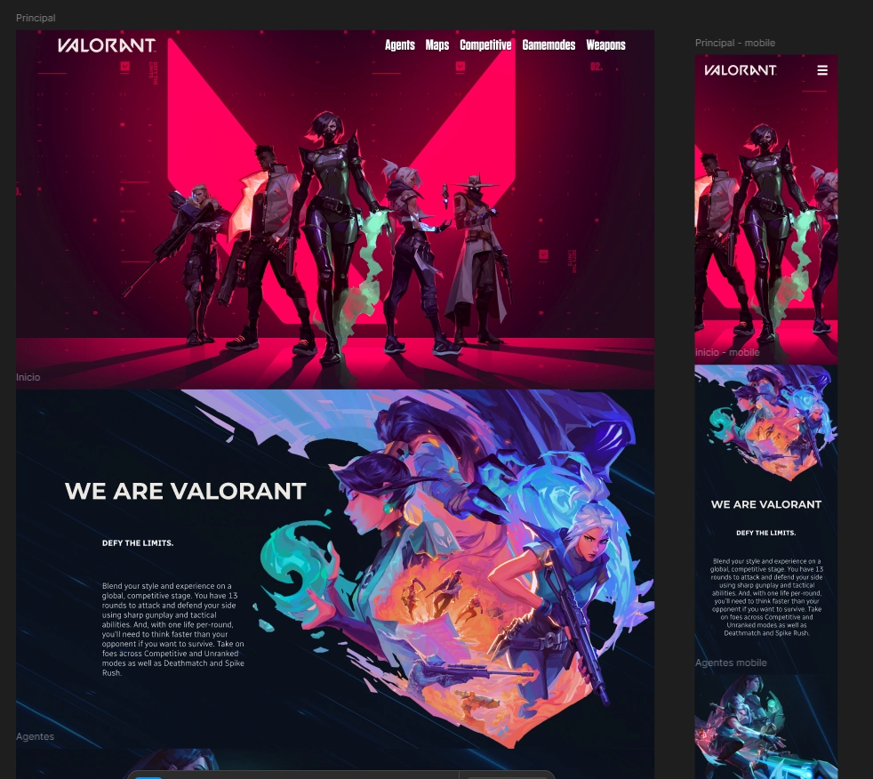
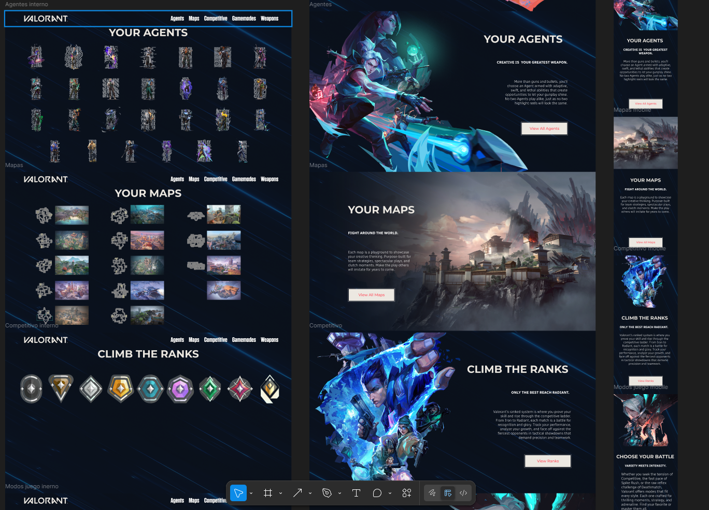
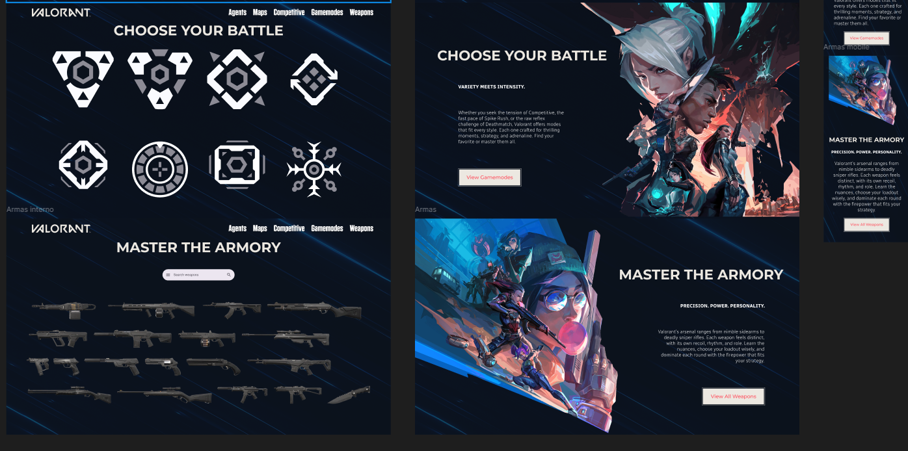

# 🔫 Proyecto Web Valorant - Consumo de API

Este proyecto es una **landing page** interactiva basada en el videojuego **Valorant**, la cual consume una API pública para mostrar información de agentes, armas (con skins), mapas y modos de juego.

---

## 🌐 Demo en línea 🚀 ¿Cómo ejecutarlo?

Puedes ver el portafolio publicado en GitHub Pages aquí:  
👉 [https://deamacevedo.github.io/Valorant/](https://deamacevedo.github.io/Valorant/)  

## 🎨 Maquetación en Figma

El diseño del sitio fue realizado previamente en Figma, donde se definieron los colores, estructura general, disposición de secciones y estilo visual del contenido.

**Puedes visualizarlo en el siguiente enlace**
https://www.figma.com/design/wOjO06kANGjh3EdjS2yNOe/Valorant-API?node-id=0-1&t=W0JK0RHeFNoJT6id-1

> 🔽 A continuación, se muestran algunas capturas del diseño realizado en Figma:





---

## 📁 Estructura del Proyecto

```plaintext
assets/
├── fonts/
├── img/
html/
├── agentes.html
├── armas.html
├── gamemodes.html
├── mapas.html
├── rankings.html
javascript
├── agents.js
├── mapas.js
├── weapons.js
├── gamemodes.js
index.html
ReadMe.md
main.js          
styles.css       
```

---

## ⚙️ Tecnologías utilizadas

- HTML5
- CSS3 / Tailwind CSS 
- JavaScript Vanilla
- Figma (para diseño de interfaz)
- [Valorant API](https://valorant-api.com/)

---


## 👨‍💻 Autor

- Dylan Acevedo

---

## 📚 Fuentes y créditos

- API oficial: [valorant-api.com](https://valorant-api.com/)
- Diseño inspirado en el estilo visual de Riot Games
